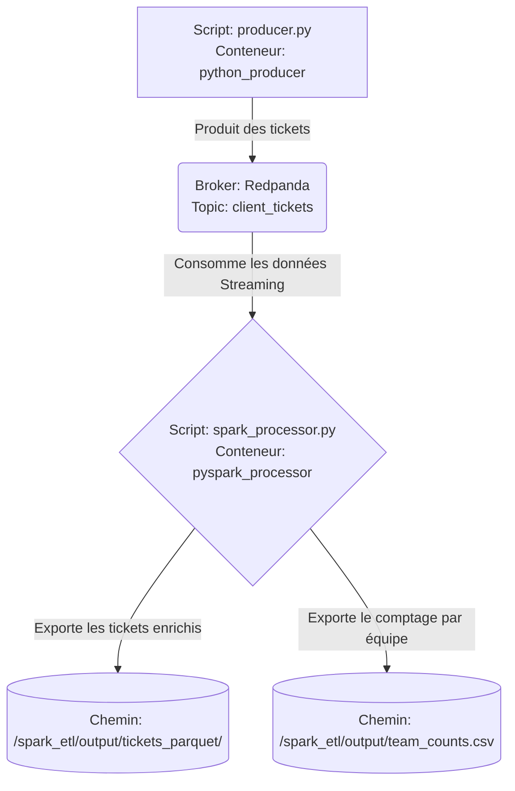

# Projet 9 : Modélisez une infrastructure dans le cloud - InduTechData

## 📝 Description du Projet
Ce projet vise à moderniser la gestion des données de l'entreprise fictive InduTechData en modélisant une infrastructure hybride (On-Premise vers Cloud AWS). 
Il se divise en deux grandes parties :
1. **L'architecture théorique :** Conception d'un schéma d'infrastructure hybride et évaluation détaillée de la compatibilité technique et financière (sécurité, coûts, interopérabilité).
2. **Le Proof of Concept (POC) :** Simulation technique d'un système de gestion de tickets clients en temps réel, en utilisant Redpanda et PySpark sur un environnement entièrement conteneurisé.

## 🔗 Code Source et Dépôt
L'intégralité du code source de ce projet est versionnée et centralisée sur GitHub :
👉 [Consulter le dépôt GitHub du projet](https://github.com/mahmoudaminfr-dotcom/OC-Projet-9-Streaming)

## 🏗️ Architecture et Flux de Données (POC)
Le diagramme Mermaid suivant illustre l'architecture et les flux du pipeline ETL mis en place spécifiquement pour le traitement des tickets clients (Exercice 2) :



## 🚀 Prérequis
Pour exécuter le POC en local, les outils suivants sont requis :
- Docker
- Docker Compose

## 🛠️ Installation et Démarrage
L'application est fonctionnelle et l'ensemble du pipeline ETL est automatisé grâce à Docker Compose. Les données de Redpanda sont persistées via un volume Docker.

1. Décompressez l'archive du projet et ouvrez un terminal à la racine du dossier.
2. Lancez la commande suivante pour construire les images et démarrer les conteneurs en arrière-plan :
   ```bash
   docker-compose up --build -d
   ```
3. Suivez l'exécution du traitement ETL en consultant les logs :
   ```bash
   docker-compose logs -f spark_etl
   ```
4. Pour arrêter l'infrastructure proprement :
   ```bash
   docker-compose down
   ```

## 🖥️ Interfaces Web de Supervision
Une fois l'infrastructure démarrée, vous pouvez suivre le traitement des données en direct via votre navigateur :
- **Redpanda Console :** [http://localhost:8080](http://localhost:8080) (Supervision du broker et des messages entrants).
- **Spark UI :** [http://localhost:4040](http://localhost:4040) (Onglet *Streaming* pour surveiller les micro-lots de traitement ETL).

## 📁 Structure du Projet
L'archive contient l'ensemble du code source organisé de la manière suivante :

- `Mahmoud_Amin_1_Schéma_de_linfrastructure_hybride_102026.png` : Le schéma de l'infrastructure hybride (Exercice 1).
- `Mahmoud_Amin_2_evaluation_compatibilite_102026.docx` : Le document d'évaluation de compatibilité et des coûts.
- `/producer` : Contient le script Python générant des tickets aléatoires, ainsi que son `Dockerfile` dédié.
- `/spark_etl` : Contient le script PySpark permettant de lire, transformer et exporter les données, avec son `Dockerfile`.
- `docker-compose.yml` : Fichier orchestrant les services Redpanda, le générateur Python et le traitement ETL PySpark.

## 🎥 Démonstration vidéo du POC
Une courte vidéo de démonstration complète de l'infrastructure de streaming (ingestion via Redpanda et traitement en temps réel avec PySpark) est disponible. Le suivi de cette vidéo permet de comprendre les flux et d'utiliser le programme correctement :
👉 [Voir la vidéo de démonstration sur Loom](https://www.loom.com/share/bf16e1ad530b462293830ad32bc8ef4d)